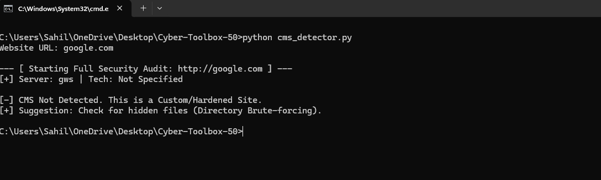
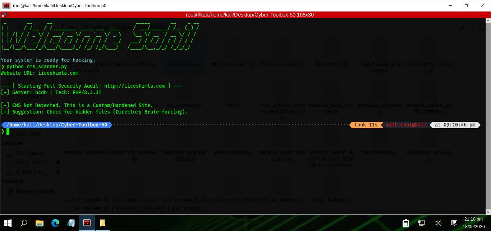

# 🛡️ Cyber-Toolbox-50

A comprehensive collection of 50 cybersecurity, network reconnaissance, security auditing, and automation tools built for both Windows and Kali Linux environments. This repository serves as an all-in-one security toolkit for GRC analysis, threat intelligence, vulnerability assessment, and policy enforcement.

---

## 📊 Tools and Output Gallery

Yahan aapke toolkit ke sabhi major tools ke live execution aur working layouts ke screenshots diye gaye hain:

| # | Tool Name | 🪟 Windows Output | 🐉 Kali Linux Output |
|---|---|---|---|
| **1** | **API Security Tester** |  |  |
| **2** | **ARP Network Discovery** |  |  |
| **3** | **Asset Inventory Scanner** |  |  |
| **4** | **Banner Grabber** |  |  |
| **5** | **Broken Link Scanner** |  |  |
| **6** | **Cloud Config Auditor** |  |  |
| **7** | **CMS Detector** |  |  |
| **8** | **CVE Searcher** |  |  |
| **9** | **Directory Enumerator** |  |  |
| **10** | **DNS Enumerator** |  |  |
| **11** | **DNS Lookup** |  |  |
| **12** | **Domain Expiry Monitor** |  |  |
| **13** | **Email Header Analyzer** |  |  |
| **14** | **Email Security Checker** |  |  |
| **15** | **File Integrity Monitor** |  |  |
| **16** | **File Permission Auditor** |  |  |
| **17** | **Firewall Rule Auditor** |  |  |
| **18** | **Hash Generator Verifier** |  |  |
| **19** | **HTTP Header Analyzer** |  |  |
| **20** | **IOC Scanner** |  |  |
| **21** | **MAC Address Finder** |  |  |
| **22** | **Malware Hash Checker** |  |  |
| **23** | **Metadata Extractor** |  |  |
| **24** | **Network Packet Sniffer** |  |  |
| **25** | **Network Scanner** |  |  |
| **26** | **Open Port Monitor** |  |  |
| **27** | **OSINT Info Gatherer** |  |  |
| **28** | **Password Strength Check** |  |  |
| **29** | **Phishing URL Detector** |  |  |
| **30** | **Port Scanner** |  |  |
| **31** | **Risk Assessment Calc** |  |  |
| **32** | **Security Compliance** |  |  |
| **33** | **Security Dashboard** |  |  |
| **34** | **Security Event Correlator** |  |  |
| **35** | **Security Report Generator** |  |  |
| **36** | **SSL Checker** |  |  |
| **37** | **SSL/TLS Auditor** |  |  |
| **38** | **Subdomain Enum** |  |  |
| **39** | **System Info Collector** |  |  |
| **40** | **System Security Analyzer** |  |  |
| **41** | **Threat Intel Aggregator** |  |  |
| **42** | **Vulnerability Scanner** |  |  |
| **43** | **Web App Fingerprinter** |  |  |
| **44** | **Web Security Header** |  |  |
| **45** | **Website Tech Detector** |  |  |
| **46** | **Website Uptime Monitor** |  |  |
| **47** | **Whois Lookup** |  |  |

---

## 📂 Project Structure & Modules

Cyber-Toolbox-50 ko 7 logical security domains mein divide kiya gaya hai:

### 1. 📈 GRC and Compliance Automation
* `asset_inventory_scanner.py` - Scans and logs network asset infrastructure.
* `cloud_configuration_auditor.py` - Audits cloud instances against security benchmarks.
* `domain_expiry_monitor.py` - Tracks domain lifecycles to prevent domain hijacking.
* `file_integrity_monitor.py` - Real-time file monitoring using cryptographic hashes.
* `file_permission_auditor.py` - Scans for loose and insecure folder privileges.
* `firewall_rule_auditor.py` - Audits active firewall configurations.
* `risk_assessment_calculator.py` - Quantifies risk levels using CVSS matrix.
* `security_compliance_checker.py` - Validates systems against standard GRC frameworks.
* `security_dashboard.py` - Centralized visual monitoring hub for compliance indicators.
* `security_report_generator.py` - Generates executive-ready compliance documents.
* `ssl_tls_configuration_auditor.py` - Checks for weak SSL/TLS cipher suites.
* `website_uptime_monitor.py` - Monitors asset availability and down-times.

### 2. 🕵️‍♂️ Threat Intelligence and Recon
* `cve_searcher.py` - Queries vulnerability databases for known public CVEs.
* `ioc_scanner.py` - Matches network logs against known malicious threat feeds.
* `malware_hash_checker.py` - Cross-references file hashes with threat intel engines.
* `metadata_extractor.py` - Extracts hidden metadata from digital documents.
* `osint_info_gatherer.py` - Public infrastructure intelligence and footprinting locator.
* `threat_intelligent_aggregator.py` - Compiles unified indicators of threat vectors.
* `website_scraper.py` - Extracts target assets and links safely for assessment.

### 3. 🌐 Network and OS Security
* `arp_network_discovery_tool.py` - Maps local layer-2 devices using ARP frames.
* `dns_enumerator.py` - Brute-forces and extracts active domain DNS zones.
* `dns_lookup.py` - Direct query interface for mapping basic DNS records.
* `mac_address_vendor_identification_tool.py` - Unmasks hardware vendor signatures.
* `network_packet_traffic_sniffer.py` - Deep packet capture and dissection layer.
* `network_scanner.py` - Discovers live targets via ICMP/TCP pinging.
* `open_port_monitor.py` - Alerts when unauthorized ports accept connections.
* `port_scanner.py` - High-speed custom multi-port mapping utility.
* `whois_lookup.py` - Retrieves ownership registry information for assets.

### 4. 🕸️ Web and API Security
* `api_security_tester.py` - Evaluates API endpoint weaknesses and authentication.
* `banner_grabber.py` - Pulls service banners to discover target software versions.
* `broken_link_scanner.py` - Finds dead hyperlinks to mitigate broken link hijacking.
* `cms_detector.py` - Identifies Content Management Systems.
* `dir_enumerator.py` - Brute-forces web directories and hidden URL paths.
* `http_header_analyzer.py` - Audits security flags like X-Frame-Options, CSP, HSTS.
* `ssl_checker.py` - Evaluates certificate validity, issuer, and expirations.
* `subdomain_enum.py` - Enumerates hidden asset subdomains for a broader attack surface.
* `vulnerability_scanner.py` - Automated scanner for common web app vulnerabilities.
* `web_application_fingerprinter.py` - Maps precise application tech stacks.
* `web_security_header_checker.py` - Rates security setups based on server responses.
* `website_tech_detector.py` - Analyzes backend components running on web targets.

### 5. 🪵 SIEM and Logging Analysis
* `security_event_correlator.py` - Ties scattered log anomalies into single security events.
* `system_info_collector.py` - Collects underlying operating system metadata logs.
* `system_security_log_analyzer.py` - Scans log files for brute-force signs and bad logins.

### 6. 🔑 Identity and Cryptography
* `email_header_analyzer.py` - Parses email transport blocks to detect spoofing vectors.
* `email_security_checker.py` - Audits SPF, DKIM, and DMARC configurations.
* `hash_generator_verifier.py` - Fast checksum verification tool (MD5, SHA-256, etc.).
* `password_strength_check.py` - Validates credential strings against entropy standards.
* `phishing_url_detector.py` - Analyzes link strings for homograph or malicious structures.
* `smart_hash_cracker.py` - Multi-threaded dictionary and brute-force hash-cracking tool.

### 7. 📜 Corporate Security Policies
* `Incident_Response_Policy.md` - Standard structured framework for incident handling.
* `Password_and_MFA_Policy.md` - Access control protocols, password rules, and MFA mandates.

---

## 🚀 How to Run the Toolkit

1. **Clone the repository:**
   ```bash
   git clone [https://github.com/Sahil-241/Cyber-Toolbox-50.git](https://github.com/Sahil-241/Cyber-Toolbox-50.git)
   cd Cyber-Toolbox-50