### 1-9 Execution Preview

| Project | Windows Output | Kali Linux Output |
| :--- | :--- | :--- |

| 1. Banner Grabber | 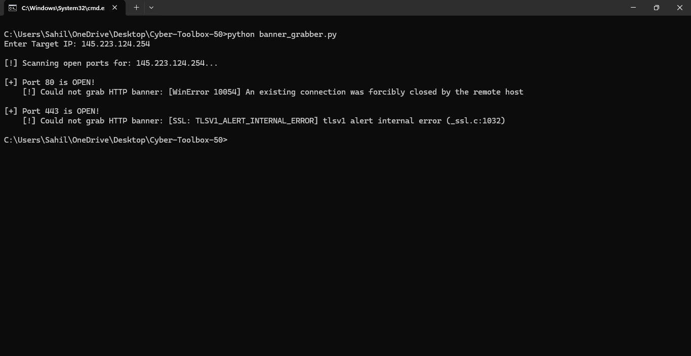 |  |
| 2. Port Scanner | 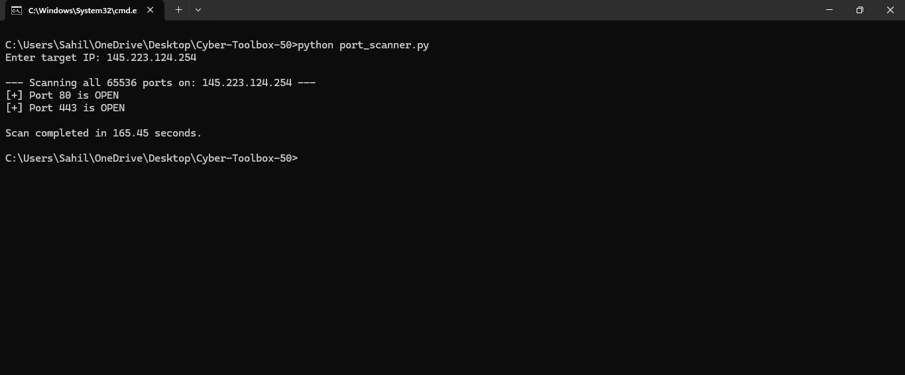 |  |
| 3. DNS Lookup | 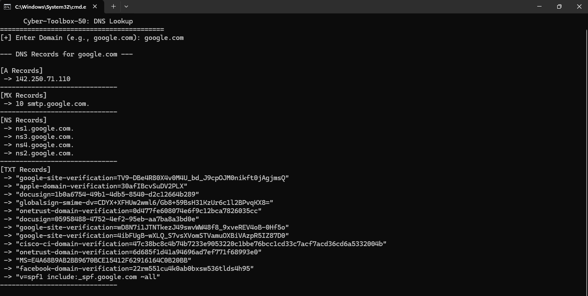 |  |
| 4. WHOIS Lookup | 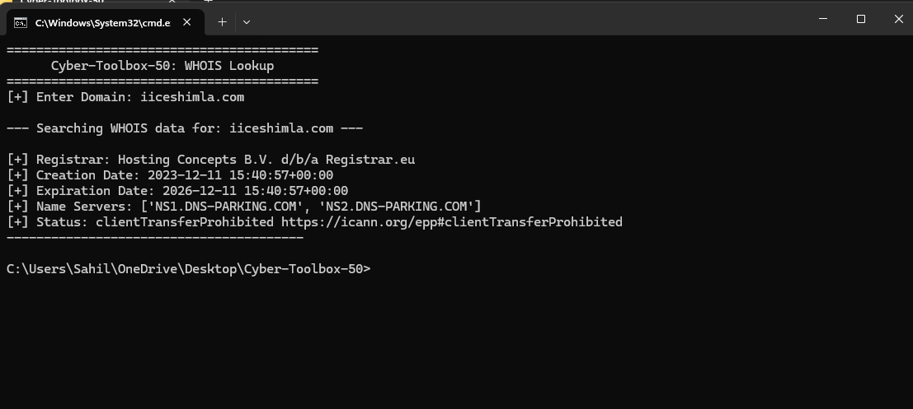 |  |
| 5. Subdomain Enum | 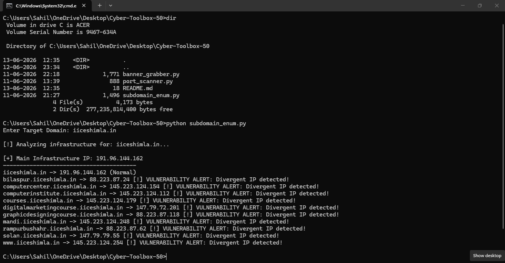 |  |
| 6. Dir Enumerator | 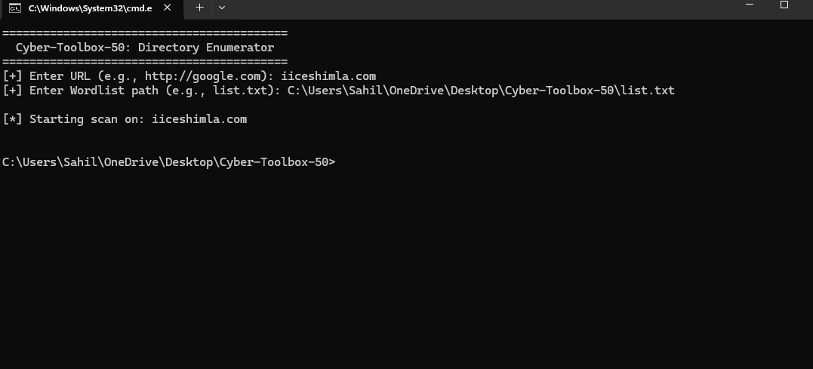 |  |
| 7. Header Analyzer |  |  |
| 8. SSL Checker | 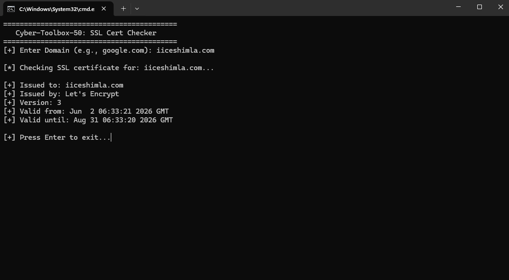 |  |
| 9. Tech Detector | 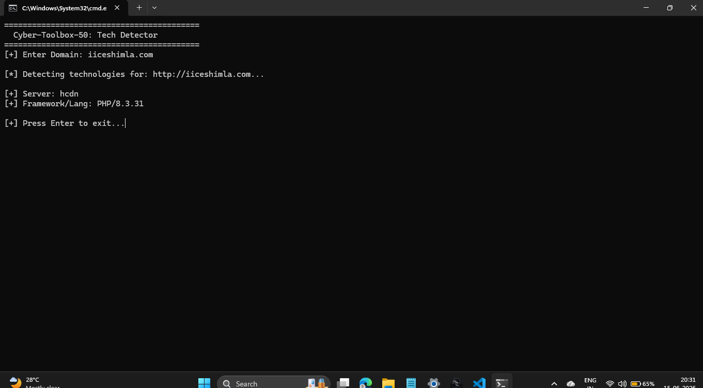 |  |
=======
Ek chhota lekin powerful reconnaissance toolkit jo infrastructure analysis aur service discovery ke liye banaya gaya hai.

## Features
- **Subdomain Enumerator**: Domain ki hidden subdomains find karne ke liye.
- **Port Scanner**: Live ports aur services identify karne ke liye.
- **Banner Grabber**: Service version detect karne ke liye.

## Execution Preview

### 1. Banner Grabber
| Windows Output | Kali Linux Output |
| :--- | :--- |
|  | 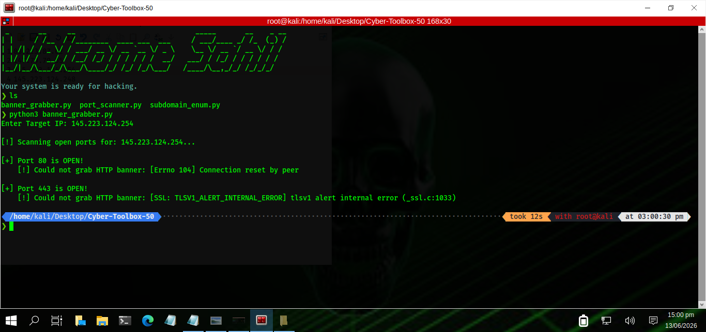 |

### 2. Port Scanner
| Windows Output | Kali Linux Output |
| :--- | :--- |
|  | 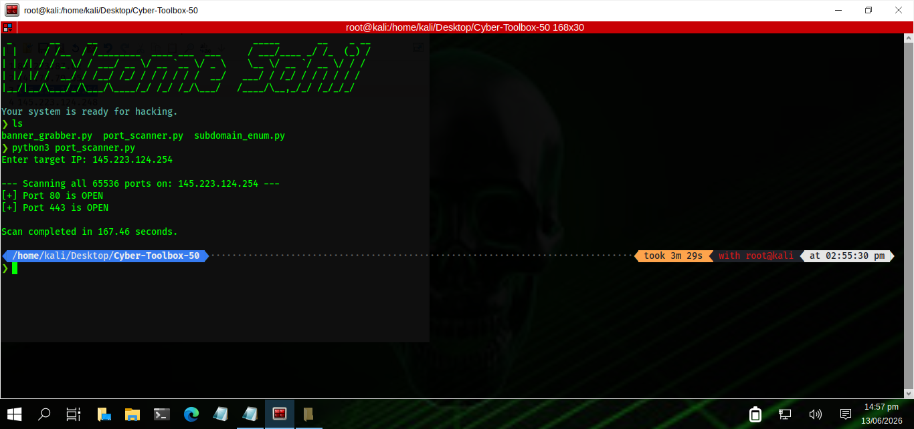 |

### 3. Subdomain Enumerator
| Windows Output | Kali Linux Output |
| :--- | :--- |
|  | 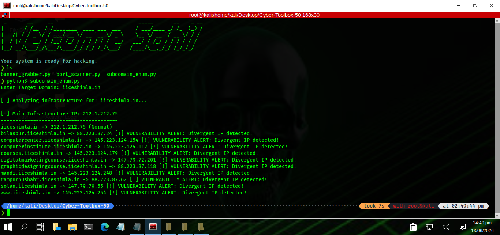 |

---
*Built with Python. Educational purposes only.*
